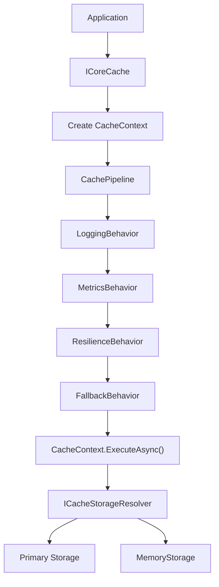
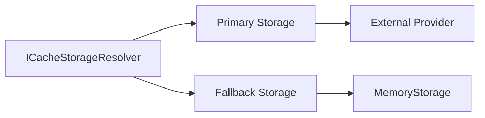

# 🏗️ Architecture

`CoreSystem.Cache` is built around a composable pipeline architecture that separates cache operations from storage implementations.

Instead of interacting directly with Redis or Memory, cache operations are represented by a `CacheContext` and executed through the `CachePipeline`. Cross-cutting concerns such as logging, metrics, resilience, and fallback are applied through pipeline behaviors before the operation reaches the selected storage provider.

This architecture keeps application code independent from storage implementations while allowing new behaviors and providers to be introduced without changing the public cache API.



---

## 🎯 Design Goals

The framework is designed around a few architectural principles:

- Keep application code independent from storage providers.
- Centralize cross-cutting concerns through the cache pipeline.
- Support multiple storage providers behind a common abstraction.
- Allow behaviors to be added without modifying the cache service.
- Keep storage implementations isolated from application code.

---

## 🏛️ Architectural Patterns

`CoreSystem.Cache` combines several patterns to keep the framework modular and extensible.

| Pattern | Purpose |
|----------|---------|
| **Pipeline** | Executes cache operations through reusable behaviors. |
| **Chain of Responsibility** | Allows each behavior to process an operation before delegating to the next behavior. |
| **Strategy** | Allows different storage implementations to be used through common abstractions. |
| **Factory** | Creates cache entry and operation-specific objects where required. |
| **Provider Pattern** | Abstracts cache storage behind `ICacheStorage`. |
| **Cache-Aside** | Provides the `GetOrAddAsync()` workflow for cache population. |

---

## 🧩 Core Components

| Component | Responsibility |
|-----------|----------------|
| **ICoreCache** | Public entry point for cache operations. |
| **CacheContext** | Represents a cache operation and contains its execution state. |
| **CachePipeline** | Executes the registered cache behaviors before the terminal operation. |
| **ICacheBehavior** | Defines a reusable pipeline behavior. |
| **ICacheStorageResolver** | Resolves the primary and optional fallback storage. |
| **ICacheStorage** | Internal abstraction implemented by cache providers. |

The application interacts with `ICoreCache`, while the remaining components keep execution and storage concerns inside the framework.

---

## 🔄 Execution Lifecycle

Every cache operation follows the same general lifecycle.

```text
Application
    │
    ▼
ICoreCache
    │
    ▼
CacheContext
    │
    ▼
CachePipeline
    │
    ├── Logging
    ├── Metrics
    ├── Resilience
    └── Fallback
    │
    ▼
CacheContext.ExecuteAsync()
    │
    ▼
ICacheStorage
```

`CoreCache` creates the appropriate context and initializes it with the primary storage.

The pipeline then executes the registered behaviors before calling the context's `ExecuteAsync()` method.

---

## ⚙️ Pipeline Behaviors

The current pipeline behaviors are:

| Behavior | Responsibility |
|----------|----------------|
| **LoggingBehavior** | Logs cache operations and failures. |
| **MetricsBehavior** | Records cache hits and misses. |
| **ResilienceBehavior** | Executes cache operations through the configured resilience pipeline when available. |
| **FallbackBehavior** | Switches to the fallback provider when the primary storage fails. |

The current behavior order is:

```text
Logging    100
Metrics    200
Fallback   300
Resilience 400
```

The pipeline sorts behaviors by their `Order` before execution.

---

## 🗄️ Storage Layer

Storage is isolated behind the internal `ICacheStorage` abstraction.



`CacheStorageResolver` selects the storage configuration at startup.

When no external storage is registered:

```text
Primary  → MemoryStorage
Fallback → None
```

When an external storage is registered:

```text
Primary  → External Provider
Fallback → MemoryStorage
```

This allows the core framework to operate without an external provider while supporting an external distributed provider when configured.

---

## ⚡ Cache-Aside Execution

`GetOrAddAsync()` is implemented through a `GetOrAddCacheContext`.

The operation is delegated to the selected storage provider, allowing provider-specific concurrency mechanisms to be used.

For the current Memory provider implementation:

```text
Get
 │
 ├── Hit ───────────────► Return value
 │
 └── Miss
      │
      ▼
 Acquire key lock
      │
      ▼
 Check cache again
      │
      ├── Hit ──────────► Return value
      │
      └── Miss
           │
           ▼
       Execute factory
           │
           ▼
       Store value
           │
           ▼
       Return value
```

The integration tests verify that concurrent calls for the same key execute the factory only once.

---

# 🏷️ Cache Tags

Tags are part of the storage abstraction and can be supplied when setting an entry or using `GetOrAddAsync()`.

```csharp
await cache.SetAsync(
    $"product:{id}",
    product,
    TimeSpan.FromMinutes(10),
    ["products"]);
```

Entries can then be invalidated by tag:

```csharp
await cache.InvalidateByTagAsync("products");
```

The Memory provider maintains indexes for both tag-to-key and key-to-tag relationships.

---

# 🌐 HTTP Cache Architecture

HTTP response caching is implemented as a separate layer on top of `ICoreCache`.

The middleware delegates requests to `IHttpCacheHandler`, which coordinates:

- `CacheableAttribute`
- Request cache policy
- Cache key generation
- Cache lookup
- Response capture
- Response cache policy
- Cache storage
- Response writing

This keeps HTTP-specific behavior outside the core cache service.

---

## 🔁 Fallback Execution

When an external primary provider fails and a fallback provider exists, `FallbackBehavior`:

1. Captures the exception.
2. Marks the primary storage as unavailable.
3. Logs the failure.
4. Changes the current context to the fallback storage.
5. Marks the operation for rehydration.
6. Executes the operation using the fallback storage.

The fallback behavior is therefore implemented in the pipeline rather than duplicated inside each cache operation.

---

## 📊 Observability

The cache pipeline integrates metrics through `MetricsBehavior`.

The current implementation records:

```text
cache.distributed.hits
cache.distributed.misses
```

The metric result is determined by cache contexts implementing `ICacheMetricContext`.

This keeps metric collection outside individual storage implementations.

---

## 🧪 Architectural Validation

The current tests validate important parts of the architecture:

- Dependency injection registration.
- Pipeline behavior execution.
- HTTP cache handling.
- Cache-Aside behavior.
- Concurrent cache population.
- Tag invalidation.
- Cache removal.
- OpenTelemetry registration.
- Middleware registration.

The integration tests also use reusable base test classes so cache behavior can be tested against different providers.

---

## 💭 Technical Assessment

The strongest part of the current architecture is the separation between:

```text
ICoreCache
    ↓
CacheContext
    ↓
CachePipeline
    ↓
ICacheStorageResolver
    ↓
ICacheStorage
```

This prevents `CoreCache` from becoming responsible for provider-specific behavior and keeps cross-cutting concerns in independent pipeline behaviors.

The architecture also allows the core package to operate with Memory alone while external providers can be introduced through the storage abstraction.

The current implementation provides a solid foundation for extending the framework without expanding the public `ICoreCache` API unnecessarily.
