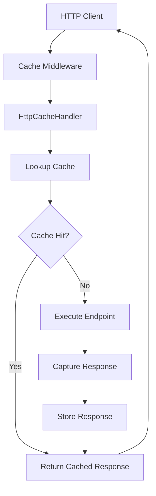

# 🌐 HTTP Response Caching

`CoreSystem.Cache` provides declarative HTTP response caching for ASP.NET Core applications.

Instead of implementing cache management logic inside controllers or Minimal APIs, the framework handles cache lookup, storage, expiration, and invalidation through middleware.

---

# Overview

When an endpoint is associated with the `Cacheable` attribute, the framework automatically:

- Generates a cache key
- Checks whether a cached response already exists
- Returns cached responses immediately
- Executes the endpoint on cache misses
- Captures the response
- Stores cacheable responses using the configured cache provider
- Applies expiration policies
- Supports tag-based invalidation

No additional cache-management code is required inside your endpoints.

---

# Architecture



---

# Enable the Middleware

Register the middleware.

```csharp
var app = builder.Build();

app.UseCoreCache();

app.Run();
```

---

# Basic Usage

Decorate an endpoint.

```csharp
[HttpGet("{id}")]
[Cacheable(expirationSeconds:300)]
public async Task<IActionResult> Get(Guid id)
{
    return Ok(await service.GetAsync(id));
}
```

The response will be cached for five minutes when it satisfies the default request and response cache policies.

---

# Minimal API Example

```csharp
app.MapGet("/products/{id}",
    async (Guid id, IProductService service) =>
    {
        return Results.Ok(await service.GetAsync(id));
    })
.WithMetadata(new CacheableAttribute(300));
```

---

# Cache Expiration

Specify the cache lifetime.

```csharp
[Cacheable(expirationSeconds:600)]
```

or

```csharp
[Cacheable(expirationSeconds:60)]
```

When no expiration is specified, the cache uses `CacheOptions.DefaultExpiration`.

---

# Using Cache Tags

Tags allow multiple cached responses to be invalidated together.

```csharp
[Cacheable(
    expirationSeconds:300,
    tag:"Products")]
```

Later:

```csharp
await cache.InvalidateByTagAsync("Products");
```

---

# Cache Key Generation

HTTP cache keys are generated automatically using:

- Request path
- Query string

Query parameters are ordered by name before the key is generated.

Example:

```text
/products/15?page=2
```

This allows different paths and query-string combinations to be cached independently.

---

# Cache Hit

```
Request
      │
      ▼
Cached Response Exists?
      │
     Yes
      │
      ▼
Return Cached Response
```

No endpoint execution occurs.

---

# Cache Miss

```
Request
      │
      ▼
Cache Miss
      │
      ▼
Execute Endpoint
      │
      ▼
Capture Response
      │
      ▼
Store Response
      │
      ▼
Return Response
```

Responses are stored only when the default response policy allows caching.

---

# Provider Independence

HTTP response caching uses the `ICoreCache` abstraction, so it is independent of the concrete storage implementation.

The supplied implementation includes:

- Memory
- External cache storage such as Redis

Changing the configured cache storage does not require changes to controllers.

---

# Pipeline Integration

HTTP response cache operations use the cache pipeline through `ICoreCache`.

When the corresponding behaviors are registered, the pipeline order is:

```text
Logging

↓

Metrics

↓

Fallback

↓

Resilience

↓

Storage
```

`Fallback` is included when an external primary storage with a memory fallback is configured, while `Resilience` is included when the Redis provider registers a Redis resilience pipeline.

HTTP response caching therefore participates in the cache pipeline's configured:

- Logging
- Metrics
- Fallback
- Resilience

---

# Best Practices

✅ Cache GET and HEAD endpoints only.

✅ Avoid caching endpoints with user-specific responses.

✅ Use cache tags for related resources.

✅ Choose expiration based on data volatility.

---

# Limitations

The default request policy does not cache:

- Methods other than GET and HEAD
- Requests containing an `Authorization` header

The default response policy does not cache:

- Responses other than HTTP 200
- Responses containing `Set-Cookie`
- Responses marked `private`
- Responses marked `no-store`